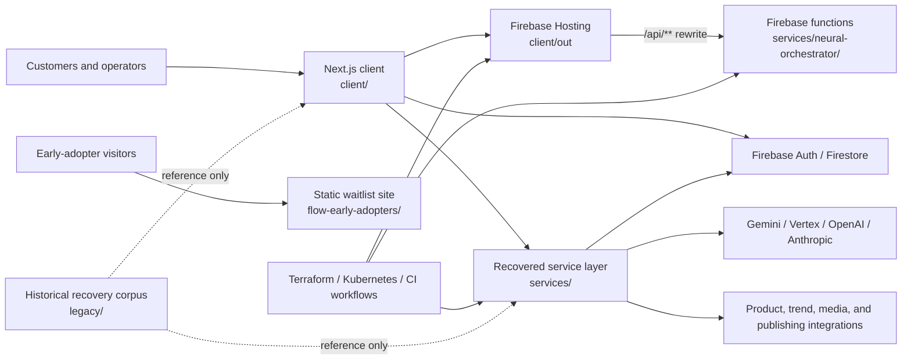

# Flow: current state and structure

- Assessment date: 2026-08-31
- Inventory baseline commit: `fb8f0d0dd844ea8c70af75051f7e35ea472d4a3c` on `main`; the report and Firebase build guard were added afterward
- Repository: <https://github.com/sethh426/flow>

## Executive assessment

Flow is now preserved in one clean repository and the main web client can be installed and built. It is a substantial recovered product, not an empty prototype: the repository contains the user interface, AI and automation services, Firebase functions and hosting configuration, infrastructure definitions, an early-adopter site, tests, documentation, and curated historical source.

It is not yet safe to describe the whole platform as production-ready. The client build passes only because TypeScript and ESLint failures are ignored by the Next.js build configuration. The backend is a collection of overlapping service generations rather than one verified deployment unit. Several recovered endpoints need authentication and authorization before any backend deployment. Dependency audits also contain high and critical advisories.

The right current label is **recovered engineering baseline with a buildable frontend**. The source recovery is complete enough to move forward without relying on the scattered archives, but the application needs a deliberate stabilization phase before public launch.

## Status at a glance

| Area | State | Evidence and meaning |
| --- | --- | --- |
| Repository recovery | Complete | 2,001 tracked files (56.35 MiB) were consolidated; 1,057 are isolated under `legacy/`. Raw archives, dependencies, caches, credentials, and secret-bearing history were excluded. |
| Main client install | Passing | `npm ci --prefix client` installed successfully. |
| Main client production build | Passing with gates bypassed | Next.js 15.5.3 generated/exported 46 build routes with Firebase variables intentionally absent. Both Next configurations disable build-time TypeScript and ESLint enforcement. |
| Client type check | Failing | 158 errors in 38 files. Main clusters are Genkit drift, missing or relocated UI modules, incomplete domain types, and historical test dependencies. |
| Client lint | Failing | 1,736 findings: 1,022 errors and 714 warnings. The canonical config, preview server, intelligence hook, and content-prediction component pass focused lint. |
| Automated tests | Present, not established as green | Eight Playwright specifications cover major UI areas, but the recovered baseline does not have a recorded passing end-to-end run. The root test script is a placeholder that exits with failure. |
| Backend services | Recovered, only partially verified | Multiple Node.js, TypeScript, Python, Java, Express, Flask, WebSocket, and Firebase services are present. They were not all installed, built, integrated, or deployed during recovery. |
| Early-adopter site source | Build passing | The static site's local build succeeds. Its current source no longer embeds a Gemini key and disables the legacy client-side admin flow. |
| Live early-adopter deployment | Online but needs remediation | `flowearlyadopters.web.app` returned HTTP 200 during recovery, but the deployed HTML differs from the safe local source and contained an old browser-side Gemini key. Rotate the key before redeploying. |
| CI | Passing, narrow scope | The `Recovery integrity` GitHub Action scans common secret formats, checks recovered backend entry points, installs/checks Trend Finder, and installs/builds the client. It does not run type checking, linting, end-to-end tests, dependency-policy enforcement, or the other service builds. |
| Deployment automation | Contained | Imported Firebase, Cloud Run, and Terraform workflows are manual-only (`workflow_dispatch`). Their destinations and credentials still require review. |
| Dependency security | Needs work | Client audit: 61 advisories (1 low, 31 moderate, 23 high, 6 critical). Early-adopter audit: 5 (1 moderate, 2 high, 2 critical). |

Detailed command results are retained in [recovery validation](recovery/VALIDATION.md), and provenance is in the [recovery inventory](recovery/INVENTORY.md).

## Logical architecture



This diagram represents intended relationships found in configuration and source. It is not proof that every connection currently works in a deployed environment.

## Repository map

Counts below describe the assessed commit, before this report was added.

| Path | Tracked files | Role | Current ownership |
| --- | ---: | --- | --- |
| `client/` | 413 | Primary Next.js 15 / React 19 product UI | Active application |
| `services/` | 98 | AI routing, automation, product/trend processing, image generation, workflow execution, and Java services | Active candidates; needs consolidation and verification |
| `functions/` | 4 | Older Firebase Express API for product moderation and stats | Recovered alternative; not the function source selected by root `firebase.json` |
| `flow-early-adopters/` | 23 | Static Firebase waitlist/landing site | Active standalone site source |
| `infrastructure/` | 32 | Terraform, Kubernetes manifests, GCP setup, deployment notes, and scripts | Deployment source, not yet revalidated |
| `terraform/` | 1 | A separate root Terraform definition | Overlaps `infrastructure/terraform/`; ownership needs a decision |
| `.github/` | 5 | Four Actions workflows plus ownership metadata | Integrity CI active; deploy workflows manual |
| `workflows/` | 1 | Trend automation pipeline definition | Active candidate |
| `trend-sources/` | 4 | Google Trends, Reddit, and fashion-news inputs | Active candidate |
| `scripts/` | 48 | Recovery, security, setup, deployment, testing, and maintenance utilities | Mixed current and historical tooling |
| `docs/` | 76 | Recovery evidence and organized documentation | Current documentation area |
| `legacy/` | 1,057 | Curated source snapshots, editor recovery, old sites, designs, and notes | Reference only; excluded from active builds |
| repository root | 215 | Entry scripts, Firebase files, assets, and a large set of historical status/setup documents | Needs later organization; do not treat filenames such as `*_SUCCESS.md` as current evidence |
| other small directories | 29 | Postman files, test harness, MCP prototypes, temporary investor site, Maven wrapper, and editor settings | Review individually before use |

Of the 2,001 tracked files, 52.8% are deliberately isolated in `legacy/`; 944 files remain outside that recovery archive. The large historical corpus is therefore preserved without being part of normal client builds.

## Main client

### Technology and layout

The primary application is in `client/` and uses:

- Next.js 15.5.3 with the App Router and React 19.1;
- TypeScript in strict mode;
- Material UI, Radix UI, Flowbite, React Flow, charts, Konva, React Query, forms, Firebase, Stripe, and Genkit/Gemini libraries;
- Playwright for cross-browser and mobile end-to-end testing.

Important source areas are:

| Path | Purpose |
| --- | --- |
| `client/src/app/` | Pages, layouts, providers, and route-specific UI |
| `client/src/components/` | Shared interface components |
| `client/src/services/` | Browser/service integration code |
| `client/src/lib/` | Firebase, utilities, intelligence, and shared application logic |
| `client/src/ai/` | Genkit flows and AI-related source |
| `client/tests/e2e/` | Eight Playwright specifications |

There are 42 checked-in `page.tsx` routes. The major product surfaces are dashboard and analytics, campaigns, content studio, product discovery and creation, Printify, workflow building, scheduling, social media, trends, FlowCoins, onboarding, pricing, authentication, image editing, and several test/demo pages.

The route tree also shows recovery overlap that should be normalized: `/login` and `/auth/login`, `/signup` and `/auth/signup`, top-level and `/dashboard/*` versions of several features, plus multiple test/demo routes. These may be intentional aliases or historical duplicates; that decision has not been made yet.

### Rendering and deployment model

`client/next.config.mjs` is now the sole Next.js configuration and defines the canonical deployment model: static export to `client/out` for Firebase Hosting, with root `firebase.json` rewriting `/api/**` to Firebase Functions. The conflicting server-oriented `next.config.ts` was removed. The repository has no checked-in active `client/src/app/api` routes.

The exported application can be previewed with `npm start --prefix client`; this serves `client/out` through the repository's dependency-free local preview server. Firebase Auth and Firestore remain disabled when their public configuration is absent, so CI and fresh clones can render authentication pages without an invalid placeholder key.

The production build still sets `ignoreDuringBuilds`/`ignoreBuildErrors`, which is why it can pass while the standalone quality checks fail. The render-time content prediction side effect was moved into React `useEffect`, eliminating the invalid relative `/api/intelligence/predict-content` request that previously appeared during static generation.

## Backend and automation inventory

The backend is better understood as several recovered generations of the architecture than as one cohesive runtime.

| Component | Runtime | Intended responsibility | Current assessment |
| --- | --- | --- | --- |
| `services/flow-orchestrator/` | Node.js, Genkit, WebSocket | Autopilot planner and frontend command stream | Has health/WebSocket server and deployment files; not integration-tested |
| `services/master-ai-orchestrator/` | Node.js, Express | Provider registration, orchestration, readiness, and system status | Has tests/scripts; not verified in the consolidated repo |
| `services/neural-orchestrator/` | TypeScript, Firebase Functions | Multi-model routing, AI endpoints, events, cleanup, and metrics | Selected by root Firebase config; build/deploy not revalidated end to end |
| `services/smart-ai-router/` | Node.js, Express | Provider routing, cost and metrics tracking | Recovered service with basic test script; not production-reviewed |
| `services/ai-orchestrator/` | JavaScript class module | Task-specific LLM orchestration and conversation logging | Single source file with no local package manifest; library/prototype status |
| `services/image-generator/` | Python, Flask | Image generation/editing and product/social variants | Includes Docker/start/test files; not installed or run during recovery |
| `services/product-mapper/` | Node.js, Express | Product normalization/mapping | Small containerized service; not verified |
| `services/trend-finder/` | Node.js 20, Express | Gemini trend discovery and Firestore persistence | Secret-returning endpoint removed; `/find` now requires a verified Firebase ID token; deployment integration still unproven |
| `services/vision-analyzer/` | Node.js, Express | Image analysis, OCR, and safety checks | Has health/test source; not verified |
| `services/workflow-executor/` | Node.js, Express | Workflow/webhook execution and status | Has health endpoint; not verified |
| `services/java/*` | Java 21, Spring Boot 3.3.5 | Analytics, batch/data processing, and external integrations | Three Maven services recovered; not built in current validation |
| `functions/` | Node.js, Firebase Functions, Express | Dashboard stats and product approve/reject API | Older parallel implementation; reads now require a verified user and moderation requires an admin claim; it is not root Firebase's selected source |
| `trend-sources/` and `workflows/` | JavaScript/YAML | Trend ingestion and pipeline definitions | Present but not exercised as a complete pipeline |

There are at least five overlapping AI coordination concepts (`ai-orchestrator`, `flow-orchestrator`, `master-ai-orchestrator`, `neural-orchestrator`, and `smart-ai-router`). Before adding features, choose a canonical request path and mark the others as libraries, experiments, or archived implementations.

## Data, hosting, and infrastructure

The recovered system is oriented around Google Cloud and Firebase:

- root `firebase.json` declares Firestore rules/indexes, Node.js 20 functions from `services/neural-orchestrator`, and static hosting from `client/out`;
- hosting sends `/api/**` to the `api` function and all other unmatched paths to the client;
- the separate `functions/` folder contains another Firebase API and is not selected by that root configuration;
- `infrastructure/terraform/` defines GKE, networking, data, AI, service-account, and monitoring modules;
- Kubernetes manifests cover orchestrators, product mapping, trend finding, Redis, and ingress;
- a separate `terraform/main.tf` and multiple deployment scripts overlap the infrastructure tree;
- Cloud Run, Firebase, and infrastructure GitHub workflows are manual-only pending destination/project review.

No real `.env`, `terraform.tfvars`, Terraform state, service-account JSON, or raw recovery archive is tracked. Configuration examples document expected variables, but a single environment contract does not yet exist.

## Early-adopter site

`flow-early-adopters/` is a standalone static site for Firebase project `flowearlyadopters`. It contains the public landing page, waitlist integration source, an audio/logo asset, Firestore rules, a Node-based minification build, and Firebase Hosting configuration.

The safe local source and the live deployment are not the same:

- the local source expects optional deployment configuration in ignored `public/config.js`, based on `config.example.js`;
- it no longer contains the recovered browser-side Gemini secret;
- its old `get-signups.html` client-side admin behavior is explicitly disabled until Firebase Authentication and server authorization are implemented;
- the live site was reachable during recovery, but its deployed HTML contained an old Gemini key and must be treated as compromised until that key is revoked.

Do not deploy the consolidated repository over the live site until the key is rotated, the Firebase project is confirmed, and a deployment preview has been reviewed.

## Security and deployment blockers

The committed tree passes the repository's known-secret-format scanner, but credential scrubbing is only one layer.

Source controls completed on 2026-08-31:

- removed the `GET /apify-token` endpoint and its Secret Manager dependency from Trend Finder;
- required a verified Firebase ID token for the billable `/find` operation and recorded the requesting user on new trend documents;
- required verified users for the recovered `functions/` data API and an `admin` or `role: admin` custom claim for product moderation;
- replaced permissive CORS with an explicit `ALLOWED_ORIGINS` list in the recovered function API;
- replaced active MCP, launch, and Java-setup personal Windows paths and credential locations with repository-relative or optional environment configuration;
- moved Trend Finder to Application Default Credentials/workload identity conventions, Node.js 20, locked dependencies, bounded JSON/query input, and matching health/readiness endpoints.

Immediate deployment blockers that remain:

1. **Rotate exposed credentials.** Revoke the Gemini key found in the live early-adopter HTML and every service-account key that appeared in the old repository or archives.
2. **Provision and test access control.** Set trusted admin custom claims, configure allowed origins, and update service callers to send Firebase ID tokens before enabling the hardened endpoints.
3. **Audit the selected backend.** The controls above cover the specifically identified recovered endpoints, not every service. The eventual canonical backend still needs systematic authentication, authorization, rate-limit, validation, and CORS review.
4. **Review Firebase rules and project IDs.** Recovered configurations reference several projects and generations. Confirm ownership, least privilege, billing protections, and environment separation before running any workflow.
5. **Resolve service dependency debt.** Trend Finder installs reproducibly but reports 12 advisories (10 moderate, 2 high); upgrade and retest before deployment.
6. **Keep deployment workflows manual.** Do not enable push-triggered deployment until the runtime topology and credentials are settled.

See [SECURITY.md](../SECURITY.md) for the repository rules. This recovery review was not a comprehensive penetration test; any internet-facing service still requires a focused security review.

## Test, build, and CI posture

What is proven:

- the committed main client installs and builds on Windows and in GitHub Actions without requiring Firebase credentials at build time;
- the 46-route static export completes without the prior render-time relative API request, and the local export server returns the root and dashboard pages successfully;
- the client health check passes all 46 critical route/component/configuration checks, with only three warnings for optional environment configuration, console logging, and TODOs;
- the early-adopter site installs and builds locally;
- the portable committed-file secret scan passes;
- the Trend Finder package installs from its lockfile and its JavaScript entry/configuration files pass syntax checks;
- a local Trend Finder HTTP smoke test returns `200` for health, `503` for readiness without Gemini configuration, and `401` for an unauthenticated `/find` request;
- the recovered Firebase function and MCP integration entry files pass JavaScript syntax checks;
- JSON/YAML recovery validation passed for the documented files.

What is not yet proven:

- a clean TypeScript compilation;
- a clean lint run;
- a passing Playwright suite against the recovered app;
- working authentication, Firestore rules, payments, publishing, Printify, AI calls, or automation with real environments;
- independent builds/tests for every Node, Python, Java, and Firebase service;
- an end-to-end path from onboarding through product selection, content generation, scheduling, publishing, and analytics;
- safe production deployment or rollback.

The integrity workflow now covers the recovered backend entry points and Trend Finder in addition to the client. It should still be expanded in stages: type checking, a controlled lint baseline, remaining unit/service builds, dependency policy, Firebase emulator tests, then a small Playwright smoke suite. Enabling every historical check at once would produce too much noise to be actionable.

## Recovery corpus and documentation reliability

`legacy/` preserves unique material from the July 2025 TAR backup, 28 Firebase Studio exports, `flow-extracted`, MCP/Nordstrom prototypes, standalone sites, design files, documents, loose artifacts, and 284 editor-history snapshots. It is intentionally excluded from active builds and should remain read-only reference material unless a file is deliberately promoted into the active tree.

The repository root includes many historical documents with names such as `ALL_SYSTEMS_GO.md`, `DEPLOYMENT_SUCCESS.md`, and `PRODUCTION_DEPLOYMENT_SUCCESS.md`. Those files describe earlier moments or intentions and conflict with current validation. For present status, use this report, `docs/recovery/VALIDATION.md`, the current CI result, and fresh command output.

## Recommended stabilization plan

### P0: before any backend or early-adopter deployment

1. Rotate/revoke the exposed Gemini and historical service-account credentials.
2. Configure and integration-test the new identity, admin-claim, allowed-origin, and workload-identity paths; the direct source flaws are closed.
3. Confirm Firebase/GCP project ownership, billing limits, secret storage, Firestore rules, and deploy identities.
4. Back up the currently deployed early-adopter site, build the safe local source, preview it, then redeploy intentionally.

### P1: establish one runnable product

1. **Completed:** use the sole `next.config.mjs` configuration for static Firebase Hosting plus Functions and the local export preview server.
2. Select one canonical AI/backend request path and define which services are required for the MVP.
3. Create a service matrix with start command, port, environment variables, health endpoint, owner, deploy target, and test command.
4. Fix the 158 TypeScript errors, starting with active routes and excluding/archive-marking `_api_backup` and dead prototypes.
5. **Partially completed:** the static-generation relative API request is fixed; run the eight Playwright specifications against a known local environment.

### P2: make quality repeatable

1. Upgrade dependencies in controlled batches and resolve the critical/high audit findings.
2. Re-enable TypeScript enforcement in `next build`, then introduce an achievable lint baseline.
3. Add emulator/integration tests for auth, Firestore rules, functions, workflow execution, and billable AI boundaries.
4. Move historical root documents and scripts into clearly labeled archive/reference areas, leaving a small operational root.
5. Consolidate duplicate Terraform, Firebase, route, and orchestrator generations.

### P3: production readiness

1. Add staging and production environments with preview deploys, rollback, monitoring, alerts, cost limits, and incident ownership.
2. Prove one complete affiliate-selling workflow end to end before expanding the feature surface.
3. Perform a focused security review and load/reliability test on the selected runtime only.

## How to run the proven surface

Requirements: Node.js 20+ and npm.

```powershell
git clone https://github.com/sethh426/flow.git
Set-Location flow
Copy-Item .env.example .env
Copy-Item client/.env.local.example client/.env.local
npm ci --prefix client
npm run dev --prefix client
```

Open `http://localhost:3000`. Missing Firebase or AI values will limit connected features; do not put real server credentials in `NEXT_PUBLIC_*` variables.

The current verification commands are:

```powershell
./scripts/security/sanitize-secrets.ps1 -Check
npm run type-check --prefix client
npm run lint --prefix client
npm run build --prefix client
```

Expect the first and last commands to pass at this baseline, and the middle two to fail with the documented debt.

## Bottom line

The recovery succeeded: Flow's scattered work is consolidated, traceable, scrubbed, and buildable from GitHub. The next milestone is not more recovery. It is reducing the recovered platform to one secure, testable runtime and proving one complete selling workflow. Until the P0 and P1 items are complete, the main app should be treated as a development system and the live early-adopter deployment as a credential-remediation task.
