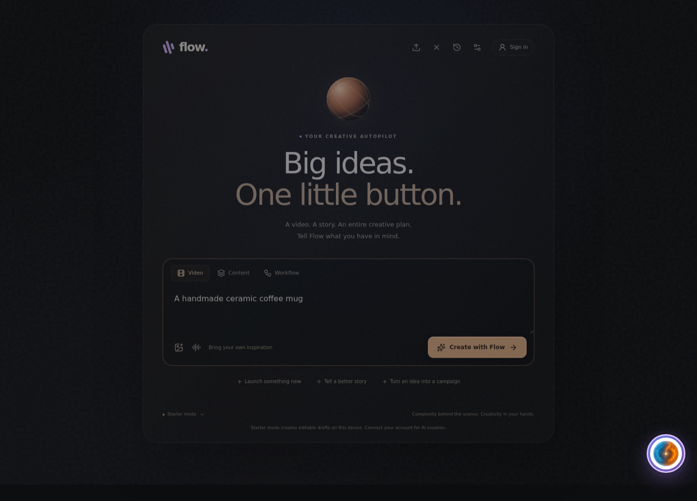

# Flow floating studio

The product opens with only the original floating Flow avatar visible. Click it to expand the creation workspace; close or minimize it without losing the current draft. The avatar can be dragged using mouse/touch or moved with arrow keys, and its position persists. Enter/Space opens it; Escape minimizes the workspace and returns focus to Flow. Dashboard navigation and competing assistants are not mounted. Legacy product entry URLs resolve to the same floating interface; authentication URLs remain available.



## What works

- One brief produces an editable creative package: opening hooks, storyboard, voiceover script, post caption, hashtags and an approval-aware workflow plan.
- An animated vertical video preview uses the same renderer as export.
- Users can add up to eight product images and one audio file. Export records a real 1080 × 1920 video with motion, titles, transitions and optional mixed audio. MP4 is selected where the browser supports recording it; otherwise WebM is used.
- Drafts and edits persist on the current device, up to 30 projects. Media remains in memory for the current session and must be reattached after reopening a draft.
- Preview playback, scene selection, timeline scrubbing, alternate openings, settings, caption copying, JSON pack export, and cancelable video export work locally.
- Import a downloaded creative JSON pack to restore an editable draft; malformed files are rejected without replacing the current draft.
- Run a local creative workflow with one button: validate the draft, render video, and package the video, caption, voiceover script, editable creative JSON and workflow plan into one ZIP. This executes local production steps, not the external publishing or analytics steps described in the plan.
- When signed in, local production runs now create an authenticated Firestore-backed production job before rendering. Flow records render/package progress, terminal failure/cancellation, and the final local ZIP metadata. The saved project keeps the job ID so reopening it can recover the last server-recorded state. Signed-out runs remain local-only. This is durable execution tracking around the proven browser renderer; it is not yet a server-side media worker and does not make the downloaded ZIP recoverable from another device.
- Signed-in production jobs now enqueue a Firebase Cloud Tasks worker before browser rendering. The worker validates the server-held creative snapshot and prepares a normalized production manifest containing the destination, duration, scene count, narration text, caption/hashtags, approval requirement and the next capability. The browser waits for `ready_for_render` before rendering. Task retries are bounded and concurrency-limited. This is the first real server-executed production stage; video composition itself still runs in the browser.
- AI narration is optional and off by default. When explicitly enabled, no user audio is attached, and the server has `FLOW_STUDIO_TTS_MODEL`, `FLOW_STUDIO_TTS_VOICE`, `FLOW_STUDIO_MEDIA_BUCKET`, and the existing `FLOW_STUDIO_OPENAI_KEY` secret configured, the production worker generates MP3 narration, stores it in the explicit private media bucket, records provider/model/voice provenance, and exposes it only through the authenticated Studio job route. Flow limits narration admission to ten charged attempts per user per UTC day. Uploaded audio always takes priority so Flow does not generate narration unnecessarily. The UI discloses that generated narration is an AI voice.
- AI scene visuals are optional and off by default. When explicitly enabled, no user images are attached, and the server has `FLOW_STUDIO_IMAGE_MODEL`, a supported `FLOW_STUDIO_IMAGE_QUALITY`, `FLOW_STUDIO_MEDIA_BUCKET`, and `FLOW_STUDIO_OPENAI_KEY`, the worker generates one 1024×1536 portrait background per scene, stores each privately, and records provider/model/quality/scene provenance. The authenticated client retrieves those assets only for the owning job, feeds them into the existing renderer, and includes them in the final ZIP. Uploaded images always take priority. Flow admits at most 24 generated scene images per user per UTC day, and retrying a job reuses already stored objects.
- AI video footage is optional and off by default. When explicitly enabled, no user images are attached, and the server has a supported GA Veo 3.1 model plus explicit region, duration, resolution and media bucket configuration, the production worker starts a Vertex AI long-running operation using the deployed Google Cloud service identity. The operation name is persisted so task retries resume the same generation instead of intentionally starting a second paid request. Flow currently admits at most 16 generated video seconds per user per UTC day. The private MP4 is streamed only to the owning signed-in job, looped silently as the moving background of the final Flow composition, and included in the ZIP as `generated-footage.mp4`. Flow narration or uploaded audio remains the final composition audio path; Veo's native audio is retained only in the raw generated MP4 for now.
- Starter mode is explicitly labeled. It creates a deterministic editable starting point, not simulated AI or research.

Video creation can now combine user media, AI-generated scene images, optional AI narration, and optionally generated Veo motion footage behind Flow's overlays. Live staging provider generation remains a separate verification step from CI doubles. Preview is silent. Keep the tab visible during real-time export. Workflow plans do not execute external actions. Nothing is automatically published, and no virality outcome is promised.

## AI configuration

The new `/api/studio/create` Firebase Hosting rewrite invokes the dedicated `studio` Function. It requires a verified Firebase session, strictly validates the brief and creative response, limits each user to 20 accepted requests per UTC day, and prevents concurrent requests per user. Failed generation attempts count toward the limit because they may still incur provider cost. A time-limited lease prevents permanently stuck users.

Configure:

1. Firebase public client configuration from `client/.env.local.example`, or a Firebase Hosting site linked to its web app. When build-time values are absent, the client fetches and validates the current origin's public `/__/firebase/init.json` configuration and initializes the installed modular SDK itself. It does not load the legacy SDK scripts from reserved URLs.
2. Firebase Secret Manager secret `FLOW_STUDIO_OPENAI_KEY`.
3. Server environment value `FLOW_STUDIO_MODEL`, specifying a chat-completions model supported by the configured OpenAI account and JSON-object response mode. No model is silently assumed.
4. Deploy the selected Functions and Hosting configuration together to a reviewed staging project. Do not deploy only the frontend and assume API creation is connected.

The provider call returns hooks, scenes, copy and a workflow plan. Media is not sent to the provider. Missing credentials, unavailable endpoints and malformed results are errors, not manufactured success. The backend does not log the brief, tokens or provider error bodies.

Account settings report account configuration and the result of `/api/studio/status`. The public status response exposes only configuration/capability flags, never credentials, and does not call the provider or authenticate a user. A configured service can still fail due to permissions, quota or provider availability. Retry connections repeats failed initialization/status requests. Auth listeners ignore stale profile reads after account changes, and profile creation uses a transaction to avoid overwriting existing accounts following a failed read. The older standalone auth helpers also await runtime initialization.

## Security changes

The hardcoded browser Printify credential and public-token fallback were removed. The exposed credential must still be revoked by the account owner; deleting source cannot revoke it or erase repository history.

The selected legacy API now requires Firebase authentication, derives user identity from the token, scopes list queries, checks product/campaign ownership by ID, and refuses to claim a workflow started when its dispatcher is absent. Direct billable legacy AI HTTP functions require a verified user. Their broader historical rate/cost policy and other recovered services still require review before deployment.

User Firestore updates cannot change tier, FlowCoins or subscription fields, and collection updates preserve the owner. Client account deletion is disabled to prevent delete/recreate credit resets; account deletion needs a server-owned implementation. User creation is restricted to the supported free profile fields. Full rules-emulator coverage remains follow-up work.

## Verification

Run:

```bash
npm ci --prefix client
npm ci --ignore-scripts --prefix services/neural-orchestrator
npm run studio:type-check --prefix client
npm run studio:lint --prefix client
npm run test:studio --prefix services/neural-orchestrator
npm run build --prefix client
npm run studio:test --prefix client
```

Browser tests require Playwright Chromium and `ffprobe` on PATH (from FFmpeg). They verify draft editing and restoration, mobile layout, settings, actual video dimensions/duration/audio, export cancellation, and serious accessibility findings. The backend suite checks input bounds, schema failures, anonymous denial, cross-user access denial and honest disconnected workflow responses.

The expanded browser suite also verifies idle-only avatar visibility, drag position restoration, keyboard control, minimizing without losing a draft, JSON import rejection/recovery, and ZIP integrity and contents. ZIP verification requires `unzip` on PATH.

The current suite contains ten browser tests plus backend coverage for authenticated creative generation, durable production jobs, queue recovery, AI narration, generated scene visuals, private artifact retrieval, quotas and retry exhaustion. Provider/database/storage paths are exercised with controlled doubles; this is not evidence of a successful live provider call. Runtime Firebase configuration is tested with valid and malformed Hosting responses; enabling account controls is not a test of successful real sign-in.

For local use after building, run `npm start --prefix client` and open `http://localhost:3000`. The static server explicitly returns a JSON service-unavailable error for API requests rather than serving HTML as an API response. AI creation requires the separately deployed authenticated Functions and configured model; the local server does not impersonate those services.

The manual Firebase deployment workflow accepts either complete `NEXT_PUBLIC_FIREBASE_*` repository variables/secrets or a verified public configuration response from the selected project's Hosting site. A preflight refuses mismatched projects and missing/unavailable configuration without logging values. It runs the focused client checks and tests the selected backend before deployment. Three preflight tests cover build configuration, runtime fallback, and rejection of wrong projects/unavailable endpoints. The server model and Secret Manager key must still be configured separately. No deployment was performed as part of this local verification.

The dedicated studio type/lint gates are enforced in CI alongside selected backend compilation/tests and browser export tests. Full-repository type/lint failures in retained legacy code remain separate debt; this change does not claim the whole repository is clean. Current production OAuth, model configuration, live provider calls and publishing are not proven by local tests.

## Next capability milestones

1. Verify the AI secret/model and Firebase auth in staging using a real account.
2. Add server-backed project/media storage with user isolation and retention controls.
3. Add licensed asset sourcing, synthesized narration and optional generated footage behind the same creation button, with spending controls and provenance.
4. Add a durable executor and one publishing connector with explicit approval, provider-confirmed IDs and idempotent retries.
5. Import real performance/conversion evidence before selecting winning openings or optimizing campaigns.

The interface should stay simple as these capabilities expand: describe the outcome, create, review the result, and approve external actions.
