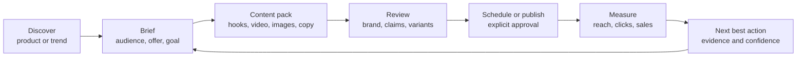
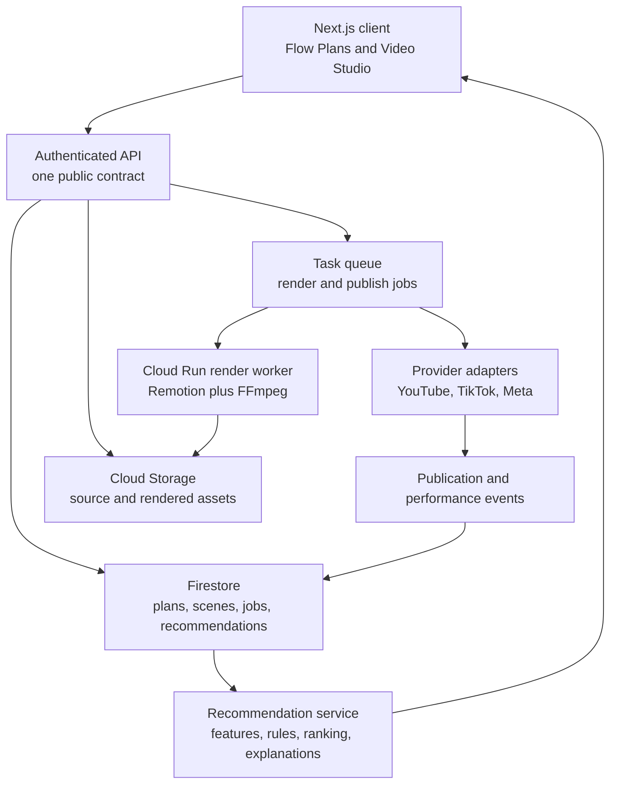

# Flow transformation roadmap

- Assessment date: 2026-09-06
- Live product: <https://flowearlyadopters.web.app/app/dashboard/>
- Repository: <https://github.com/sethh426/flow>
- Current Hosting release: 2026-09-06 16:44:28 EDT (`build-info.generatedAt`: `2026-09-06T20:42:00.018Z`)
- Current operating mode: public configuration/mock-mode frontend; production automation is not enabled
- Canonical Firebase target: `flowearlyadopters`; see the [Firebase consolidation report](../integration/FIREBASE_CONSOLIDATION_2026-09-06.md)

## Executive direction

Flow does not need another disconnected feature. It needs one trustworthy path from an opportunity to a measurable sale:

> **Choose a product -> understand the opportunity -> create a campaign and content pack -> review a video -> publish -> measure -> receive the next best action.**

The recovered application already contains many of the pieces: product discovery concepts, trends, campaign management, a workflow builder, AI copy tools, an image editor, a richer hidden content studio, scheduling, social connection screens, analytics, and an assistant. The problem is that these pieces currently behave like separate prototypes. Several rely on mock data, duplicate routes, incompatible response shapes, or backend operations that do not exist.

The highest-value transformation is therefore a **complete vertical selling loop**, not a larger menu. A user should be able to finish a real campaign in one workspace and always know:

1. what Flow recommends;
2. why it recommends it;
3. what will happen if the user approves it;
4. whether the action is a preview, draft, or live operation; and
5. what result the action produced.

## Product diagnosis

### What is already strong

- The live dashboard has a credible visual foundation and useful concepts: performance, growth, activity, intelligence, trends, and quick actions.
- The recovered repository contains more product depth than the primary navigation reveals.
- The richer content studio already has templates, brand kits, media, versions, export controls, animation concepts, and a canvas editor.
- The product, trend, campaign, content, workflow, scheduler, social, and analytics domains are represented in the codebase.
- The Firebase/Google Cloud footprint is a reasonable foundation for identity, data, storage, queued work, and hosting.

### What the app needs most

| Priority | Need | Why it matters now |
| --- | --- | --- |
| 1 | One end-to-end campaign journey | Users cannot currently travel from recommendation to creative to publishing to measured result without crossing disconnected or incomplete pages. |
| 2 | Truthful live data and action states | Sample metrics, simulated actions, and real-looking integration controls are mixed together. This makes it hard to trust the app. |
| 3 | One canonical content studio | The main navigation opens a basic generator while a richer studio exists under a different route. Flow needs one creator, not competing prototypes. |
| 4 | A constrained short-video workflow | Current video support is mostly labels, templates, scripts, and media types. There is no scene model, timeline, render job, or playable output pipeline. |
| 5 | Actionable, evidence-based recommendations | Current intelligence is spread across widgets and mock/rule-based services. Recommendations need evidence, confidence, expected impact, and a direct action. |
| 6 | One backend and contract | Multiple orchestrators and endpoint generations overlap. The frontend and backend already disagree on basic content response shapes. |
| 7 | Product-quality gates | Type checking, linting, end-to-end coverage, security remediation, observability, and cost controls need to become release gates for active code. |

## Evidence from the live and source audit

The September 6 audit found the following concrete issues:

- `/app/content-studio/` only exposes image, text, and template generation. Its inactive tabs have weak contrast, it does not persist a content library, and it does not create video.
- The mock `/api/generate-content` response is nested below `content`, but the page reads top-level `imageUrl` and `text` fields. The visible generator therefore cannot reliably consume its own mock contract.
- `/app/dashboard/content-studio/` contains the stronger editor, but it is not the destination in the primary navigation and becomes crowded at a 1280-pixel viewport.
- `/app/flow-a-gram/` is still a spinner and “Coming Soon” placeholder.
- `/app/campaigns/` can remain in a blank loading state when Firebase returns no authenticated user.
- `/app/products/` and dashboard product surfaces expose inconsistent sample/empty states through duplicate route families.
- Social connection buttons imply real OAuth flows, but the required backend routes are absent.
- The scheduler can show realistic scheduled posts while the provider integrations are not live.
- Several pages inherit the generic “Unified Workspace” title instead of route-specific framing.
- The app has conceptual `video`, `reel`, animation, media, and video-script types, but no persistent storyboard, timeline, video composition, render worker, or publishing job.
- The client currently reports 158 TypeScript errors and 1,736 lint findings, while production builds bypass those checks.
- The live static host has no working `/api/**` backend. The selected `affiliateflow-abzfy` function candidate is hardened but not deployed, and key automation, social, testing, and image operations remain incomplete.

These details should be read with the [current-state report](../CURRENT_STATE_AND_STRUCTURE.md), [endpoint audit](../integration/ENDPOINT_AND_SERVICE_AUDIT.md), and [`affiliateflow-abzfy` function review](../integration/AFFILIATEFLOW_FUNCTION_REVIEW.md).

The Firebase inventory found that the Product Mapper's 52 product documents are field-for-field duplicates of the records in `affiliateflow-abzfy`, the intended investor deck is already present at `/investors/`, and `appy-32f2xp` contains only an unverified historical connector plus small reference artifacts. None should become another frontend or be merged blindly. The long-term consolidation target is the existing `flowearlyadopters` project, with selected backend resources migrated only after rules, identity, contracts, and rollback have been verified.

## North-star experience: the Flow Plan

The product should reorganize around a persistent **Flow Plan**. A Flow Plan represents one product, offer, or campaign opportunity and holds its brief, creatives, publications, results, and recommendations.



### Flow Plan screen

Every active plan should answer five questions above the fold:

- **Objective:** What outcome is this campaign trying to produce?
- **Readiness:** What is complete, missing, or blocked?
- **Next action:** What should the user do now, and why?
- **Assets:** What is ready to review, revise, or publish?
- **Performance:** What happened after publication?

A plan can use a six-step rail:

1. Opportunity
2. Brief
3. Create
4. Review
5. Publish
6. Learn

Users may move between steps, but Flow should keep one primary call to action and preserve context instead of sending them into unrelated dashboards.

## Recommended information architecture

Reduce the product to six primary areas:

| Area | Purpose | Absorbs or replaces |
| --- | --- | --- |
| Home | Prioritized work, performance, alerts, and recent plans | Dashboard widgets and AI Intelligence summaries |
| Opportunities | Product discovery, trend validation, economics, and saved ideas | Products, trends, winner finder, scattered recommendation cards |
| Plans | Campaign briefs, execution status, approvals, and outcomes | Campaigns plus the useful parts of workflow management |
| Create | Content packs, asset library, image tools, and Video Studio | Both content-studio routes, image editor, Flow-A-Gram placeholder |
| Publish | Calendar, channel connections, drafts, approvals, and delivery status | Scheduler and social-media connection pages |
| Insights | Attribution, experiments, creative performance, and learned recommendations | Analytics, engagement, forecasting, and optimization widgets |

The Flow Assistant should be a contextual side panel across these surfaces. It should read the current plan, selected scene, recommendation, or failure state. It should not become another destination that duplicates the rest of the product.

## Recommendation system: from generic insights to decisions

Flow should not merely generate more suggestions. It should rank **next actions**.

### Recommendation card contract

Every recommendation should contain:

```text
Action:           The concrete change or task
Why now:          The evidence that triggered it
Expected impact:  Direction and estimated range, never false precision
Confidence:       Low / medium / high plus the basis for that rating
Effort and cost:  Time, provider cost, ad spend, or operational risk
Applies to:       Product, plan, creative, audience, or channel
Primary CTA:      Apply, create variant, schedule test, or inspect
Controls:         Dismiss, snooze, not relevant, and feedback reason
Provenance:       Data sources and last updated time
```

### Recommendation families

1. **Opportunity:** product demand, competition, margin, seasonality, and audience fit.
2. **Strategy:** offer, audience segment, positioning, channel, and campaign objective.
3. **Creative:** hook, format, duration, shot structure, caption, CTA, thumbnail, and brand consistency.
4. **Distribution:** channel, posting window, cadence, metadata, and repurposing.
5. **Experiment:** the single variable to test next and the minimum useful measurement window.
6. **Operations:** broken connection, failed render, missing approval, exhausted quota, or stale data.

### Inputs and learning loop

Recommendations should combine four explicit evidence groups:

- business profile and user constraints;
- product economics and saved opportunities;
- creative and publishing history;
- performance events and external trend signals.

Begin with transparent rules and scoring. Store the features and explanation used for every recommendation. Add learned ranking only after Flow has enough accepted/dismissed recommendations and outcome data. A recommendation without sufficient evidence should say so instead of inventing certainty.

## Video Studio: proposed product design

### Design principle

Start with a brief and a storyboard, not a blank canvas. Most affiliate creators need a strong structure and editable output faster than they need unlimited design controls.

### Creation input

The first panel asks for:

- product or Flow Plan;
- audience and customer problem;
- campaign goal and offer;
- target platform;
- duration and aspect ratio;
- brand kit and voice;
- uploaded or generated source assets;
- testimonial, claim, disclosure, and CTA constraints.

Flow then generates a content pack and a storyboard. For a short video, each scene contains a thumbnail, media source, duration, voiceover line, on-screen text, caption timing, transition, and purpose such as hook, proof, demonstration, or CTA.

### Editor layout

```text
+----------------+-----------------------------+----------------------+
| Scenes         | Preview                     | Inspector            |
| 01 Hook        |                             | Scene / Text / Brand |
| 02 Problem     |       9:16 canvas           | Motion / Audio / CTA |
| 03 Demo        |       with safe zones       |                      |
| 04 Proof       |                             | AI: rewrite scene    |
| 05 CTA         |                             |                      |
+----------------+-----------------------------+----------------------+
| Timeline: video/images | text | voice | music | captions           |
+--------------------------------------------------------------------+
| Variants | Comments | Version history | Render / Export / Publish |
+--------------------------------------------------------------------+
```

At tablet widths, the scene rail and inspector become drawers. On mobile, editing becomes scene-by-scene; the full multi-track timeline remains a desktop feature.

### Video MVP boundaries

The first usable release should support:

- 9:16, 1:1, and 16:9 compositions;
- 15-, 30-, and 60-second template structures;
- uploaded video clips and images;
- generated still images;
- crop, fit, pan, zoom, and basic transitions;
- editable text, brand fonts/colors, safe zones, and CTA cards;
- voiceover, music, and automatically timed captions;
- preview, render progress, retry, cancel, versioning, and MP4 export;
- thumbnail export and platform-specific caption/hashtag variants;
- a clear affiliate disclosure field and a final approval gate.

Do **not** begin with unrestricted generative video, a professional nonlinear editor, real-time collaborative editing, or dozens of integrations. A deterministic template renderer will produce useful, repeatable content sooner and will be easier to test, price, and explain. Generative B-roll can be added later behind a provider interface.

### Content pack output

One generation action should create a coherent package rather than one disconnected asset:

- three hook choices;
- one editable short-video storyboard;
- one rendered short-video variant;
- three channel-specific captions;
- one carousel or image set;
- two thumbnails;
- one email or landing-page block;
- the recommended first experiment.

All outputs share the same brief and variant lineage, so Flow can later identify whether the hook, visual, offer, or CTA changed performance.

## Target technical architecture

Use the existing Firebase property as the product control plane, with a separate render worker for long-running media work.



### Architecture decisions

- Keep Firebase Hosting, Auth, Firestore, and Storage as the shared application foundation.
- Select one TypeScript API entry point and retire or quarantine overlapping orchestrators after behavior is migrated.
- Publish an OpenAPI contract or shared TypeScript schema package. Generate or validate both client and server types from it.
- Treat image generation, language models, voice, music, generative video, and social networks as provider adapters. Domain records should not contain vendor-specific assumptions.
- Use background jobs for renders, scheduled publishing, imports, and performance sync. Jobs must be idempotent and expose queued, running, succeeded, failed, cancelled, and retrying states.
- Store immutable source assets and versioned render manifests. A render must be reproducible from the manifest, template version, and referenced asset versions.
- Record every external side effect with the approving user, timestamp, provider response, and retry state.
- Keep mock mode, but make it an explicit demo workspace with a persistent banner and deterministic fixtures. Never mix demo records with live records.

Remotion is a strong fit for the first renderer because it can render React compositions programmatically, accepts JSON input properties, supports H.264 output and progress callbacks, and matches the existing React codebase. The render should run in a queue-backed worker rather than in a browser request. Firebase documents task queues specifically for time-consuming or resource-intensive work with retry and rate controls. TikTok and YouTube should be separate publishing adapters because their authorization, media transfer, review, and status behavior differ.

## Canonical data model

| Entity | Essential responsibility |
| --- | --- |
| Workspace | Membership, plan, limits, defaults, and audit scope |
| BusinessProfile | Brand voice, audience, offers, disclosure rules, and brand kit |
| Product | Source, economics, claims, media, status, and evidence |
| Opportunity | Trend and product evidence, score components, freshness, and decision |
| FlowPlan | Goal, audience, product, offer, readiness, owner, and state |
| CreativeProject | Shared brief, target formats, brand kit version, and asset relationships |
| Storyboard / Scene | Ordered narrative, media, text, audio, timing, and transition data |
| Asset | Type, origin, rights/provenance, storage reference, metadata, and versions |
| Variant | Parent lineage and the exact hook, visual, offer, CTA, or format changed |
| RenderJob | Manifest, progress, output, duration, cost, error, retry, and timestamps |
| Publication | Channel, account, consent, schedule, status, provider identifier, and URL |
| PerformanceEvent | Impressions, views, watch time, clicks, conversions, revenue, and source |
| Recommendation | Evidence, score, confidence, action, feedback, and measured outcome |
| Experiment | Hypothesis, variants, success metric, guardrail, window, and result |

## Delivery roadmap

Dates below are planning ranges, not promises. Each phase has an outcome gate; incomplete foundations should not be hidden by starting more surface features.

### Phase 0 — Restore product truth and coherence (1–2 weeks)

Status on 2026-09-06: the first Phase 0 release is live. The primary Create route now opens the canonical editor; the legacy dashboard creator route shares it; campaigns no longer hang without Firebase Auth; the default campaign collection is empty; and dashboard revenue, click, conversion, activity, and recommendation claims were replaced with honest setup states. Video templates are explicitly labeled as framing previews until a storyboard, timeline, captions, audio, and renderer exist.

**Outcome:** A user can distinguish demo from live behavior, navigate one route per job, and never hit a silent blank screen.

- Add a global `Demo workspace` badge and label every simulated result/action.
- Fix the Campaigns indefinite-loading path and all empty/error states.
- Fix the content-generation response contract.
- Choose the richer creator as canonical `/app/create/`; migrate useful pieces from the simple page and redirect duplicates.
- Replace generic page titles and resolve cramped/low-contrast creator and social layouts.
- Consolidate duplicate product, campaign, content, and social routes behind a route map.
- Add API contract tests for all calls reachable from primary navigation.
- Disable or clearly mark controls whose backend operation does not exist.

**Exit gate:** All primary routes render at 390, 768, 1280, and 1440 pixels; no horizontal overlap; no permanent loaders; every action identifies demo, draft, or live behavior.

### Phase 1 — Establish the live foundation (2–4 weeks)

**Outcome:** An authenticated user can create, retrieve, update, and delete real records through one production API.

- Enable and secure the selected Firebase backend project.
- Complete Auth integration and server-side Firebase token validation.
- Define the canonical schemas and migrate active client types.
- Implement Workspace, BusinessProfile, Product, FlowPlan, CreativeProject, and Asset APIs.
- Add Cloud Storage uploads with file validation, quotas, and provenance.
- Add structured logs, request IDs, error monitoring, usage/cost events, and budget alerts.
- Move active code behind type-check, lint, unit, contract, and smoke-test gates.
- Rotate or revoke historical credentials and remediate active dependency advisories.

**Exit gate:** Two separate users cannot access each other's data; active CRUD and asset flows pass contract/e2e tests; demo and live workspaces cannot mix data.

### Phase 2 — Complete the first selling loop (3–5 weeks)

**Outcome:** A user can create a Flow Plan, generate a coherent content pack, approve it, schedule/export it, and record an outcome.

- Build the six-step Flow Plan workspace.
- Implement brief templates for affiliate launch, product proof, comparison, and evergreen education.
- Generate hooks, script, shot list, captions, images, thumbnails, and experiment suggestion from one brief.
- Add asset library, version history, approvals, and disclosure/claim checks.
- Support downloadable/schedulable drafts before broad direct publishing.
- Record publication URLs and user-entered or imported outcome data.
- Turn the Home dashboard into a prioritized queue of real plans and blocked actions.

**Exit gate:** A new user can complete a real, reviewable campaign without leaving Flow or encountering simulated success.

### Phase 3 — Ship Video Studio MVP (4–6 weeks)

**Outcome:** A user can turn a Flow Plan into an editable, rendered short video.

- Add the storyboard and scene data model.
- Build the responsive scene rail, preview, inspector, and constrained timeline.
- Add templates for problem/solution, listicle, product demo, testimonial, comparison, and offer countdown.
- Implement media upload/generation, safe cropping, text motion, captions, voiceover, music, and CTA cards.
- Create queue-backed render jobs with progress, retry, cancel, and versioned output.
- Export MP4 plus thumbnails in 9:16, 1:1, and 16:9.
- Add visual regression fixtures and render golden tests.

**Exit gate:** At least 95% of valid test manifests render successfully, failures are recoverable, and a user can create a 30-second branded video from a product brief in under 10 minutes.

### Phase 4 — Make recommendations defensible (3–5 weeks)

**Outcome:** Flow ranks next actions using product, creative, publication, and performance evidence.

- Implement the recommendation card contract and evidence drawer.
- Normalize opportunity, content, and performance features with freshness metadata.
- Start with explainable scoring and policy rules; log inputs and versions.
- Add accept, edit, dismiss, snooze, and reason feedback.
- Build creative-specific suggestions for hooks, pacing, captions, CTA, length, format, and next experiment.
- Measure recommendation adoption and downstream lift without claiming causation prematurely.

**Exit gate:** Every recommendation is reproducible, inspectable, dismissible, and tied to a direct workflow action.

### Phase 5 — Connect distribution and learning (4–8 weeks)

**Outcome:** Approved content can publish through provider adapters and automatically return status/performance signals.

- Implement one platform end-to-end before adding the next.
- Use YouTube Shorts as the engineering proof for authenticated/resumable video upload; add TikTok after its product configuration, scopes, consent UX, domain verification, and audit path are prepared.
- Add Meta/Instagram only after confirming current account eligibility and review requirements.
- Implement token vaulting, refresh, revocation, provider health, webhook verification, and failed-publish recovery.
- Add experiment assignment and outcome analysis.
- Introduce guarded workflow execution with dry-run, approval, idempotency, limits, and an audit trail.

**Exit gate:** Users see accurate provider status from approval through processing, failure, publication, and measurement; no automated external action occurs without the configured guardrail.

### Phase 6 — Scale quality and intelligence (ongoing)

- Add more publishing and commerce adapters only when the provider abstraction is proven.
- Add generative B-roll/video as an optional scene source, never as the only path to a result.
- Improve ranking from observed feedback and outcomes.
- Add team roles, comments, approval policies, template governance, and reusable brand systems.
- Track unit economics per generated asset, rendered minute, connected provider, and acquired/retained user.

## First 30-day build board

### P0 — Week 1

- Fix Campaigns blank loading and display an actionable unauthenticated/configuration state.
- Correct `/api/generate-content` request/response types and add a contract test.
- Add the demo/live status banner and deterministic fixture seed.
- Change navigation to the richer content studio and mark the weaker route for redirect.
- Map every primary UI control to implemented, mocked, missing, or intentionally disabled backend behavior.

### P0 — Week 2

- Create the canonical route map and remove duplicate entry points from navigation.
- Add error, empty, loading, offline, and permission states to every primary surface.
- Define shared schemas for Product, FlowPlan, CreativeProject, Asset, Recommendation, and Job.
- Add visual smoke coverage at four target widths.
- Establish CI checks for the active route slice; do not wait for all legacy lint debt to be fixed before protecting new work.

### P1 — Weeks 3–4

- Stand up authenticated Product, FlowPlan, CreativeProject, and Asset APIs.
- Add Storage upload and a real asset library.
- Build the Flow Plan shell and brief step.
- Generate the first coherent content pack from one persisted brief.
- Prototype the storyboard schema and a 30-second vertical composition with server-side render progress.

## Product and engineering scorecard

| Metric | Why it matters | Initial target after relevant phase |
| --- | --- | --- |
| Activation | User creates a first Flow Plan and brief | Measure funnel; establish baseline before optimization |
| Time to first useful asset | Speed from brief start to approved output | Under 10 minutes for the Video Studio MVP |
| Content-pack completion | Whether generation leads to reviewable work | At least 60% of started packs reach review |
| Publish/export rate | Whether creation produces action | At least 40% of approved packs publish or export |
| Recommendation action rate | Whether recommendations are useful | Track accept/edit/dismiss by family; avoid a vanity aggregate |
| Render success | Reliability of valid render manifests | At least 95%, with recoverable failures |
| Median render time | User-perceived production speed | Record by duration/resolution before setting a cost-aware SLO |
| Cost per approved asset | Whether AI/media unit economics work | Track model, voice, render, storage, and retry costs |
| Experiment lift | Whether Flow improves outcomes | Report confidence and sample size; do not show false precision |
| Data freshness | Whether recommendations use current evidence | Show last update and stale status per source |
| Trust defects | Silent failures, fake success, or mislabeled demo data | Zero in release-gated primary journeys |

## What not to build yet

- More dashboard widgets without a direct action.
- Another AI chat destination.
- A second content editor.
- Fully autonomous posting, ad spending, messaging, or following.
- A broad no-code workflow marketplace before one guarded workflow executes reliably.
- Custom generative-video infrastructure before the deterministic render pipeline works.
- More provider integrations before one provider completes authentication, publishing, status, revocation, and recovery.
- A complex attribution model before publication and conversion events have consistent identifiers.

## Definition of “great”

Flow is complete enough to deserve its promise when a real user can:

1. connect or enter a product and its economics;
2. receive an explainable opportunity recommendation;
3. approve a campaign brief;
4. generate and edit a coherent content pack, including a real short video;
5. review brand, disclosure, and publishing settings;
6. publish or export without a simulated success state;
7. see verified delivery and performance data; and
8. act on a next recommendation whose evidence and expected impact are visible.

Until that loop is reliable, new features should be evaluated by one question: **does this move a user closer to a published, measured, improved campaign?**

## External implementation references

- Remotion programmatic renderer: <https://www.remotion.dev/docs/renderer/render-media>
- Firebase task queue functions: <https://firebase.google.com/docs/functions/task-functions>
- YouTube video upload guide: <https://developers.google.com/youtube/v3/guides/uploading_a_video>
- TikTok Direct Post guide: <https://developers.tiktok.com/docs/en/content-posting-api-get-started>
