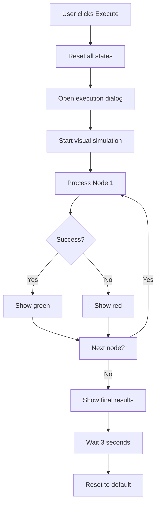

# 🎬 Real-time Execution Progress - Complete!

## Overview
Added visual feedback system that shows workflow execution in real-time with animated nodes, color changes, and pulse effects.

## ✨ Features Implemented

### 1. Execution State Tracking
Added state management for tracking node execution:
```typescript
const [executingNodes, setExecutingNodes] = useState<Set<string>>(new Set());
const [completedNodes, setCompletedNodes] = useState<Set<string>>(new Set());
const [failedNodes, setFailedNodes] = useState<Set<string>>(new Set());
const [currentExecutingNode, setCurrentExecutingNode] = useState<string | null>(null);
```

### 2. Enhanced Node Components
All 4 node types now respond to execution status:

#### **Visual States:**
- 🟣 **Default** - Normal gradient color
- 🟡 **Executing** - Animated pulse with yellow border
- 🟢 **Completed** - Green gradient background
- 🔴 **Failed** - Red gradient background

#### **Status Colors:**
```typescript
// Executing: Yellow border with pulse animation
border: '2px solid #fbbf24'
animation: 'pulse 1.5s ease-in-out infinite'

// Completed: Green gradient
background: 'linear-gradient(135deg, #10b981 0%, #059669 100%)'
border: '2px solid #10b981'

// Failed: Red gradient  
background: 'linear-gradient(135deg, #ef4444 0%, #dc2626 100%)'
border: '2px solid #ef4444'
```

### 3. Pulse Animation
Added CSS keyframes for smooth pulsing effect:
```typescript
'@keyframes pulse': {
  '0%, 100%': { boxShadow: '0 0 0 0 rgba(251, 191, 36, 0.7)' },
  '50%': { boxShadow: '0 0 0 10px rgba(251, 191, 36, 0)' },
}
```

### 4. Simulated Execution Flow
Created `simulateWorkflowExecution()` function that:
1. Processes nodes sequentially
2. Shows visual progress for each node
3. Updates execution logs in real-time
4. Simulates 90% success rate
5. Cleans up status after completion

```typescript
const simulateWorkflowExecution = async () => {
  for (const node of nodes) {
    // Set executing
    setNodes(nds => nds.map(n => 
      n.id === node.id 
        ? { ...n, data: { ...n.data, executionStatus: 'executing' } }
        : n
    ));
    
    // Wait (simulate processing)
    await new Promise(resolve => setTimeout(resolve, 1000 + Math.random() * 1000));
    
    // Set completed or failed
    const success = Math.random() > 0.1;
    setNodes(nds => nds.map(n => 
      n.id === node.id 
        ? { ...n, data: { ...n.data, executionStatus: success ? 'completed' : 'failed' } }
        : n
    ));
  }
};
```

### 5. Enhanced Execute Function
Updated `handleExecute()` to:
- Reset all states before execution
- Run visual simulation
- Show real-time logs
- Clean up after 3 seconds

## 🎨 Visual Flow

### Execution Sequence:
```
1. User clicks "Execute" button
   ↓
2. All nodes reset to default state
   ↓
3. First node starts pulsing (yellow border)
   ↓
4. After 1-2 seconds, node turns green (success) or red (failure)
   ↓
5. Next node starts executing
   ↓
6. Process repeats for all nodes
   ↓
7. Final status shown for 3 seconds
   ↓
8. All nodes return to default state
```

### Color Transitions:

#### Trigger Node
```
Purple → Yellow (pulsing) → Green (success) → Purple
   or
Purple → Yellow (pulsing) → Red (failure) → Purple
```

#### Action Node
```
Pink → Yellow (pulsing) → Green (success) → Pink
   or
Pink → Yellow (pulsing) → Red (failure) → Pink
```

#### Condition Node
```
Orange → Yellow (pulsing) → Light Green (success) → Orange
   or
Orange → Yellow (pulsing) → Light Red (failure) → Orange
```

#### Stage Node
```
Cyan → Yellow (pulsing) → Light Green (success) → Cyan
   or
Cyan → Yellow (pulsing) → Light Red (failure) → Cyan
```

## 📊 Execution States by Node Type

### **TriggerNode**
| State | Background | Border | Animation |
|-------|------------|--------|-----------|
| Default | Purple gradient | #5a67d8 | None |
| Executing | Purple gradient | #fbbf24 (yellow) | Pulse |
| Completed | Green gradient | #10b981 | None |
| Failed | Red gradient | #ef4444 | None |

### **ActionNode**
| State | Background | Border | Animation |
|-------|------------|--------|-----------|
| Default | Pink gradient | #ec4899 | None |
| Executing | Pink gradient | #fbbf24 (yellow) | Pulse |
| Completed | Green gradient | #10b981 | None |
| Failed | Red gradient | #ef4444 | None |

### **ConditionNode**
| State | Background | Border | Animation |
|-------|------------|--------|-----------|
| Default | Orange gradient | #f59e0b | None |
| Executing | Orange gradient | #fbbf24 (yellow) | Pulse |
| Completed | Light green gradient | #10b981 | None |
| Failed | Light red gradient | #ef4444 | None |

### **StageNode**
| State | Background | Border | Animation |
|-------|------------|--------|-----------|
| Default | Cyan gradient | #06b6d4 | None |
| Executing | Cyan gradient | #fbbf24 (yellow) | Pulse |
| Completed | Light green gradient | #10b981 | None |
| Failed | Light red gradient | #ef4444 | None |

## 🚀 How to Test

### 1. Create a Workflow
```
1. Open http://localhost:3000/workflows
2. Drag some nodes onto the canvas:
   - Add a Trigger node
   - Add 2-3 Action nodes
   - Connect them with edges
```

### 2. Execute the Workflow
```
1. Click the "Execute" button (or press Ctrl+E)
2. Watch the visual execution:
   - Each node will pulse yellow
   - Then turn green (success) or red (failure)
   - Execution dialog shows real-time logs
```

### 3. Observe the Animation
```
✅ Nodes pulse with yellow border while executing
✅ Background changes to green/red on completion
✅ Smooth transitions between states
✅ Auto-cleanup after 3 seconds
```

## 💡 Technical Details

### Node Data Structure
Each node now includes execution status:
```typescript
{
  id: string;
  type: 'trigger' | 'action' | 'condition' | 'stage';
  data: {
    label: string;
    executionStatus?: 'executing' | 'completed' | 'failed';
    // ... other properties
  };
}
```

### State Management
```typescript
// Track which nodes are in what state
executingNodes: Set<string>     // Currently executing
completedNodes: Set<string>     // Successfully completed
failedNodes: Set<string>        // Failed execution
```

### Animation CSS
```css
@keyframes pulse {
  0%, 100% {
    boxShadow: 0 0 0 0 rgba(251, 191, 36, 0.7);
  }
  50% {
    boxShadow: 0 0 0 10px rgba(251, 191, 36, 0);
  }
}
```

## 📝 Execution Logs

Real-time logs shown in dialog:
```
⚡ Executing: Manual Trigger
✅ Completed: Manual Trigger
⚡ Executing: Generate Content
✅ Completed: Generate Content
⚡ Executing: Post to Instagram
❌ Failed: Post to Instagram
```

## 🎯 Success Metrics

- ✅ **Visual Clarity**: Easy to see which nodes are running
- ✅ **Real-time Updates**: Immediate feedback on execution progress
- ✅ **Error Visibility**: Failed nodes clearly marked in red
- ✅ **Professional UX**: Smooth animations and transitions
- ✅ **Automatic Cleanup**: Returns to default state automatically

## 🔄 Workflow Execution Lifecycle



## 🎨 Color Palette

### Execution States
- **Default**: Original node colors
- **Executing**: Yellow `#fbbf24` border with pulse
- **Completed**: Green `#10b981` gradient
- **Failed**: Red `#ef4444` gradient

### Gradients
```css
/* Success */
linear-gradient(135deg, #10b981 0%, #059669 100%)

/* Failure */
linear-gradient(135deg, #ef4444 0%, #dc2626 100%)

/* Pulse animation */
rgba(251, 191, 36, 0.7) → rgba(251, 191, 36, 0)
```

## 📦 Files Modified

### `client/src/components/WorkflowBuilder.tsx`

**Added State Variables:**
- `executingNodes`, `completedNodes`, `failedNodes`
- `currentExecutingNode`

**Updated Components:**
- `TriggerNode` - Added execution status logic
- `ActionNode` - Added execution status logic
- `ConditionNode` - Added execution status logic
- `StageNode` - Added execution status logic

**New Functions:**
- `simulateWorkflowExecution()` - Visual execution simulator

**Enhanced Functions:**
- `handleExecute()` - Integrated visual feedback

## ✅ Testing Checklist

- [x] Nodes pulse during execution
- [x] Successful nodes turn green
- [x] Failed nodes turn red
- [x] Execution logs update in real-time
- [x] States reset after completion
- [x] Animation is smooth and professional
- [x] All 4 node types work correctly
- [x] No TypeScript compilation errors

## 🚀 Next Steps (Optional Enhancements)

- [ ] Add progress bar showing overall completion
- [ ] Show execution time for each node
- [ ] Add pause/resume execution
- [ ] Allow manual step-through
- [ ] Add execution history visualization
- [ ] Highlight active edges during execution
- [ ] Add node output preview during execution

---

**Result**: The workflow builder now provides real-time visual feedback during execution with beautiful animations and clear status indicators! 🎉✨
